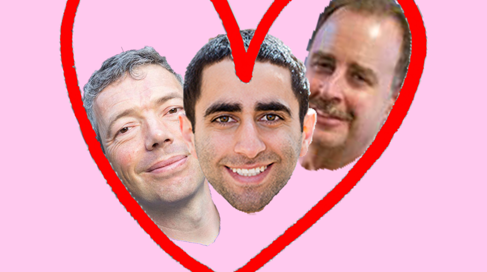

# Prothit Halder
## User Page

**Welcome!** I am a third year *math-cs* major at UC San Diego.

A quote that best describes me is 
 > Don't settle. Start Living.

 My favorite line of code is
 ```
print("Hello World!")
 ```

My favorite website is [youtube](https://www.youtube.com/)

Section Link: [README](https://github.com/prorick/CSE110Lab1-#cse110lab1-)

My favorite food:
 

 A list of my favorite foods:
- Poke
- Sushi
- Tacos
- Korean Fried Chicken
  
A ranked list of my top 3 colors
1. Blue
2. Black
3. Purple

My goals:
- [x] Research
- [ ] Learning new foods to cook
- [ ] Finding a software engineering internship